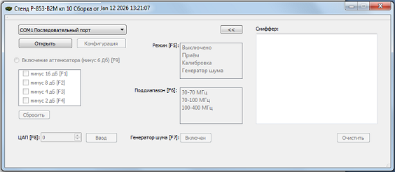
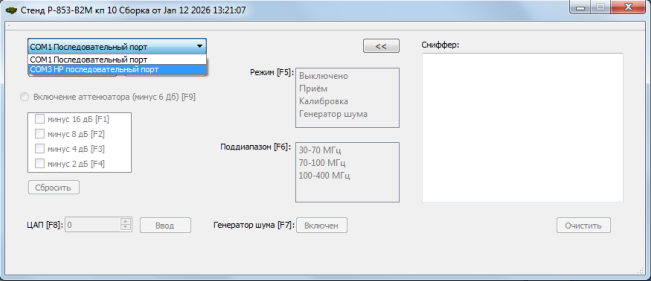
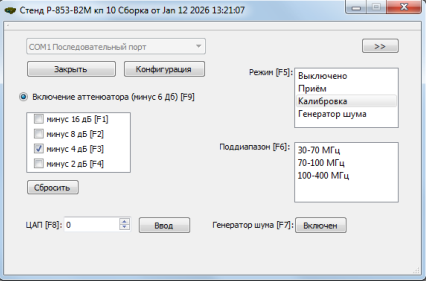
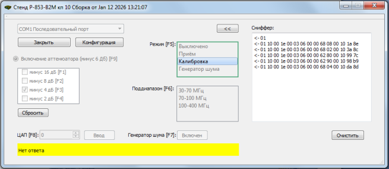
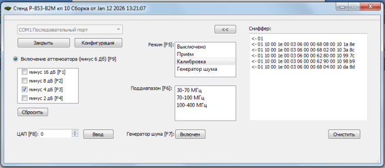

# P853_10_stend_pg

Утилита для управления радиостанцией через адаптер (COM-порт).

## Описание

Утилита на языке С++ для управляющего устройства (УУ), которое сопрягается с радиостанцией через специализированный адаптер по интерфейсу RS-232. Программа позволяет выполнять настройку и калибровку радиостанции.

### Задание режима работы адаптера

После включения питания адаптер ожидает задания режима работы (конфигурирования). 

УУ инициирует конфигурирование путем формирования перепада сигнала DTR из состояния "лог. "1" в состояние "лог. "0", после чего посылает однобайтовую команду с режимом работы адаптера.

В течение 100 мс ожидается однобайтовый ответ. Возможные сценарии: 
* ответ получен, бит 7: "1" – успешное конфигурирование;
* ответ не получен/ бит 7: "0" – режим работы адаптера не установлен, дальнейший процесс прерывается.

В случае успешного конфигурирования устанавливаются настройки радиостанции по умолчанию путем вызова функций 06H и 10H.

### Работы с платой радиостанции через адаптер

#### Функция 10Н
Общий порядок записи:
* УУ записывает в регистр «передаваемой посылки» слово данных (адресный байт и биты данных), а в регистр «управления» размер передаваемого слова данных (в битах), в результате чего адаптер выполняет цикл обмена;
* Адресный байт в старшей тетраде содержит адрес модуля, а в младшей тетраде адрес регистра внутри модуля;
* Для платы адрес модуля всегда равен 6;
* В составе платы имеются два регистра с адресами 8 и 2.

Запись в регистры «передаваемой посылки» и «управления»
<table>
  <thead>
    <tr>
      <td><b>Адрес адаптера (8 бит)</b></td>
      <td><b>Функция (8 бит)</b></td>
      <td><b>Начальный адрес регистра (16 бит)</b></td>
      <td><b>Количество регистров (16 бит)</b></td>
      <td><b>Счётчик байтов (8 бит)</b></td>
      <td><b>Значение регистра 30 (резерв, 16 бит)</b></td>
      <td><b>Значение регистра «передаваемой посылки» (16 бит)</b></td>
      <td><b>Значение регистра «управления» (16 бит)</b></td>
      <td><b>CRC (16 бит)</b></td>
    </tr>
  </thead>
  <tbody>
    <tr>
      <td>01</td>
      <td>10H</td>
      <td>30</td>
      <td>3</td>
      <td>6</td>
      <td>0</td>
      <td>Слово данных (адресный байт и биты данных)</td>
      <td>Размер слова данных в битах</td>
      <td></td> 
    </tr>
  </tbody>
</table>

Значение записываемых параметров (слово данных)
<table>
  <tbody>
    <tr>
      <td><b>Бит</b></td>
      <td>D15</td> <td>D14</td> <td>D13</td> <td>D12</td> 
      <td>D11</td> <td>D10</td> <td>D9</td> <td>D8</td> 
      <td>D7</td> <td>D6</td> <td>D5</td> <td>D4</td> 
      <td>D3</td> <td>D2</td> <td>D1</td> <td>D0</td>
    </tr>
    <tr>
      <td rowspan="2"><b>Назн.</b></td>
      <td colspan="8"><b>Адресный байт</b></td>
      <td colspan="8" rowspan="3"><b>Биты данных</b></td>
    </tr>
    <tr>
      <td colspan="4">Адрес модуля</td>
      <td colspan="4">Адрес регистра</td>
    </tr>
    <tr>
      <td><b>Знач.</b></td>
      <td colspan="4">6</td>
      <td colspan="4">2 / 8</td>
    </tr>
  </tbody>
</table>

Биты данных.Адресный байт 68H.
<table>
  <thead>
    <tr>
      <td><b>Бит</b></td>
      <td><b>Значение</b></td>
    </tr>
  </thead>
  <tbody>
    <tr>
      <td>D7</td>
      <td></td>
    </tr>
    <tr>
      <td>D6</td>
      <td>Diapazon3 (30-70)</td>
    </tr>
    <tr>
      <td>D5</td>
      <td>Diapazon2 (70-100)</td>
    </tr>
    <tr>
      <td>D4</td>
      <td>Diapazon1 (100-400)</td>
    </tr>
    <tr>
      <td>D3</td>
      <td>RF (Прием)</td>
    </tr>
    <tr>
      <td>D2</td>
      <td>Kalibr (Настройка)</td>
    </tr>
    <tr>
      <td>D1</td>
      <td>Gnoise (Включение генератора шума)</td>
    </tr>
    <tr>
      <td>D0</td>
      <td></td>
    </tr>
  </tbody>
</table>

Биты данных.Адресный байт 62H.
<table>
  <thead>
    <tr>
      <td><b>Бит</b></td>
      <td><b>Значение</b></td>
    </tr>
  </thead>
  <tbody>
    <tr>
      <td>D7</td>
      <td>Вкл/выкл аттенюатора (минус 6 дБ)</td>
    </tr>
    <tr>
      <td>D6</td>
      <td>Аттенюатор минус 16 дБ</td>
    </tr>
    <tr>
      <td>D5</td>
      <td>Аттенюатор минус 8 дБ</td>
    </tr>
    <tr>
      <td>D4</td>
      <td>Аттенюатор минус 4 дБ</td>
    </tr>
    <tr>
      <td>D3</td>
      <td>Аттенюатор минус 2 дБ</td>
    </tr>
    <tr>
      <td>D2</td>
      <td></td>
    </tr>
    <tr>
      <td>D1</td>
      <td></td>
    </tr>
    <tr>
      <td>D0</td>
      <td></td>
    </tr>
  </tbody>
</table>

#### Функция 06Н
Общий порядок записи:
- УУ записывает в специализированный регистр адаптера слово данных (биты данных), в результате чего адаптер выполняет цикл обмена с заданным по умолчанию регистром платы.

<table>
  <thead>
    <tr>
      <td><b>Адрес адаптера (8 бит)</b></td>
      <td><b>Функция (8 бит)</b></td>
      <td><b>Адрес регистра (16 бит)</b></td>
      <td><b>Значение регистра (16 бит)</b></td>
      <td><b>CRC (16 бит)</b></td>
    </tr>
  </thead>
  <tbody>
    <tr>
      <td>01</td>
      <td>6</td>
      <td>10</td>
      <td>Слово данных (биты данных)</td>
      <td></td> 
    </tr>
  </tbody>
</table>

Слово данных содержит значение ЦАП от 0 до 1023.

### Вычисление контрольной суммы
Используется табличный способ вычисления контрольной последовательности, основанный на стандарте CRC-16/MODBUS. 
После завершения вычисления регистр CRC содержит остаток от деления полинома сообщения на образующий полином, причем старший разряд остатка находится в младшем бите регистра. 

### Внешний вид программы 

#### Порт закрыт

#### Выбор порта

#### Порт открыт (без сниффера)

#### Выбор настройки радиостанции

#### Доступен выбор настроек

